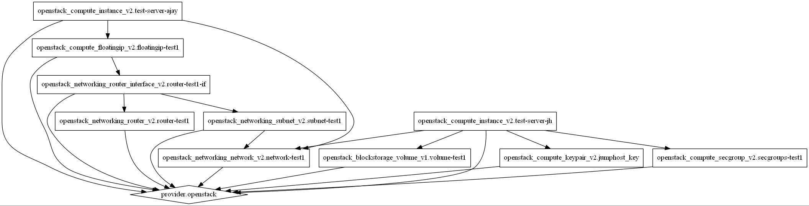

# bootstrap-openstack-terraform
Bootstrapping an openstack tenant using terraform with some basic elements.

Terraform openstack script that creates a simple network, two servers with different flavors, gets a floating IP and assigns it to one of the server.

#### Openstack services created by this script are:

- Key pair

- Network

- Subnet with CIDR from variables file as defined

- Router with gateway and interface

- Floating IP

- Security groups

- Two servers with different flavors and configurations

## Prerequisites:

- **Opensatck tenant** with sufficient resources.

- [**Terraform**](https://www.terraform.io/downloads.html) installed.

- [**GraphViz**](http://www.graphviz.org/) (Optional, Reqd only if you want to execute `terraform graph`) installed

## How to? 

Basic commands to deploy above mentioned openstack services:

1) `terraform plan` :  Generates, shows execution plan and does a syntax check.

2) `terraform apply` : Builds or changes infrastructure according to terraform scripts.

3) `terraform destroy` : Destroys Terraform managed infrastructure.

# Terraform graph

Terraform graph feature can be used to generate a visual representation of execution plan

- To generate a dot file of the plan: `terraform graph | dot -O`
- To convert a dot file to a JPEG image: `dot -Tjpeg noname.gv.dot -o plan.jpeg`

Visual representation of the plan that is executed by this repo.

 

